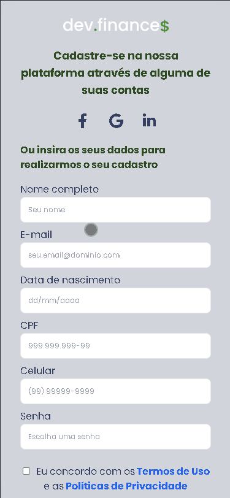

<h1 align="center">
  
</h1>

 

## **<h2 align="center">Aplicação front end 📟 👨‍💻</h2>**

## 
<h2 align="center">Projeto de controle financeiro desenvolvido na Maratona Discover ministrada pela [Rocketseat](https://app.rocketseat.com.br/dashboard)</h2> 

## **<h2 align="center">Fui além do desafio proposto</h2>**

### <h3 align="center">Além de adicionar novas features ao projeto: página de cadastro e de login, toda a estilização da aplicação foi feita utilizando o framework [TailwindCSS](https://tailwindcss.com/docs)</h3>

# **Página de cadastro e de login - Desktop Layout** 💻

  

 

# **Dashboard - Desktop Layout** 💻

  

 

# **Página de cadastro e de login - Mobile Layout** 📱

  

 

# **Dashboard - Mobile Layout** 📱

  

 

## 🚀 Tecnologias utilizadas:

 

## :memo: Licença

Esse projeto está sob a licença MIT. Veja o arquivo [LICENSE](https://github.com/rocketseat-education/maratona-discover-01/blob/main/LICENSE.md) para mais detalhes.

## **
Muito obrigado ao pessoal da Rocketseat 🚀 pelo excelente conteúdo e didática, é nítido o impacto dessa empresa nos meus estudos 🙂
**

## **
Iniciando a caminhada para poder participar da maratona nesse mundo da programação 🏃‍
**

### 
 <h2 align="center"> Mais uma aplicação realizada por Matheus da Cruz 👨‍💻 </h2> 

